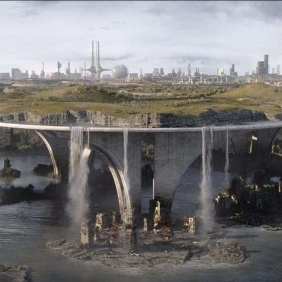

# 2. Concept - Adria 2084

The year is **2084**.

After starting colonisation on Mars in the fifties, disaster has struck Earth. A series of
catastrophic disasters led to an apocalypse in 2064 in which most of the population became
extinct. Some were still able to emigrate to Mars (current population of Mars: 7 500 000 Martians), while
others were evacuated by spacecrafts, The Titanic Spaceships (each carrying 20 000
passengers and crew).  
In 2068, a group of pioneers returned to Earth and started rebuilding. In
doing so, they faced a number of challenges: sea level rose by two metres, only solar energy, clean
water is scarce, ...   
Yet, fifteen years later, they managed to allow colonisation again on a place
called **Adria**. Meanwhile, there are already 10 000 000 inhabitants on Adria and they are ready for
full expansion.

Your task is to think of **a product that will enhance Adria's lives** and serve as **a way forward to
shape a new civilisation** on our blue planet.

Mind you that we are focusing on **reshaping civilisation as we know it**. On Adria, we get a fresh
start. It is not bound by Terran laws. The only law that is in effect, is **maritime law**. 
Maritime law states that land cannot be owned, it belongs to the whole of the community. However, whatever is on or within the land can (i.e. mining, foraging, …). The owner of the resources has the right to defend his possessions with necessary measures

**The Adria Council** serves as the guardian of fundamental rights and ethical principles in the
newly colonized world of Adria. Comprising wise leaders and visionaries, the Council is
dedicated to ensuring justice, preserving individual freedoms, and fostering a harmonious
society. Through thoughtful deliberation and guidance, they aim to protect humanity's dignity
and promote sustainable coexistence in this new era.

Your company, product, service - or all of the above - has the power to attribute to this new way
of living and create a better version of humanity.

Take a moment to think about the following challenges/restrictions

   -   **Climate-resilient cities**: many coastal cities need to been redesigned to withstand
       rising sea levels and extreme weather events. Buildings need to be constructed with
       advanced materials and technologies to resist damage from storms and floods.
   -   **Sustainable energy**: renewable energy sources such as solar, wind, and hydroelectric
       power have become the only energy sources. Advanced energy storage systems ensure
       a stable power supply.
   -   **Green transportation**: we need to invest in efficient and eco-friendly public
       transportation systems.
   -   **Sustainable agriculture**: to ensure food security, vertical farming, and hydroponics have
       become popular methods for growing crops in urban areas. Genetic engineering and
       precision agriculture have improved crop yields and reduced the need for pesticides.
   -   **Technological advancements**: advances in artificial intelligence, robotics, and
       nanotechnology have led to innovations in healthcare, education, and manufacturing.
       These technologies have played a crucial role in rebuilding and improving society.
   -   **Environmental restoration**: large-scale reforestation and habitat restoration efforts are
       underway to restore ecosystems and biodiversity. Efforts to clean up polluted areas and
       protect endangered species are a top priority.
   -   **Education and awareness**: education needs to become a cornerstone of rebuilding
       society. People are educated about sustainability, environmental conservation, and
       disaster preparedness from a young age.
   -   **Resilient infrastructure**: critical infrastructure, including power grids, communication
       networks, and transportation systems, has been fortified to withstand future disasters.
       Redundancies and decentralized systems are in place to ensure continuity of services.
   -   **A new mindset**: the global population has adopted a more mindful and sustainable way
       of life. People prioritize the well-being of the planet and future generations, making
       conscious choices to minimize waste and resource consumption.

  

<figure>
    
</figure>

 

<em>"Embrace the challenges of today to forge the possibilities of tomorrow.      
In the face of adversity, we find the strength to shape a world  
where resilience, unity, and innovation light the way toward a brighter future."</em>

