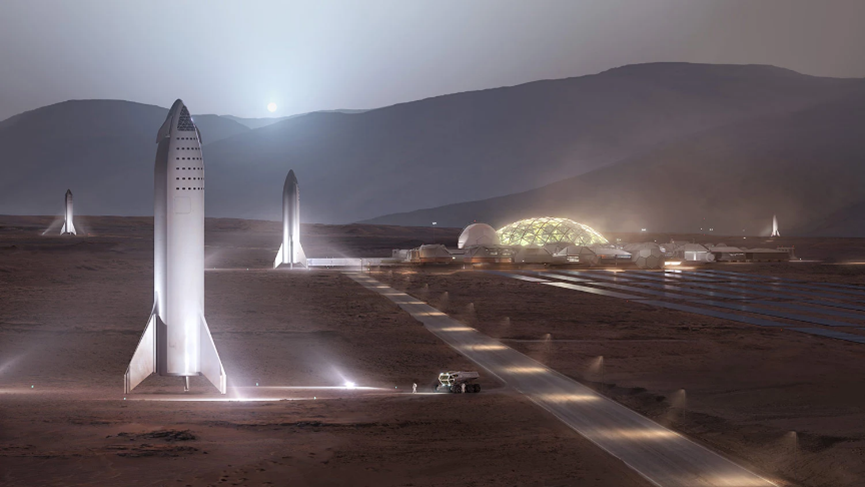
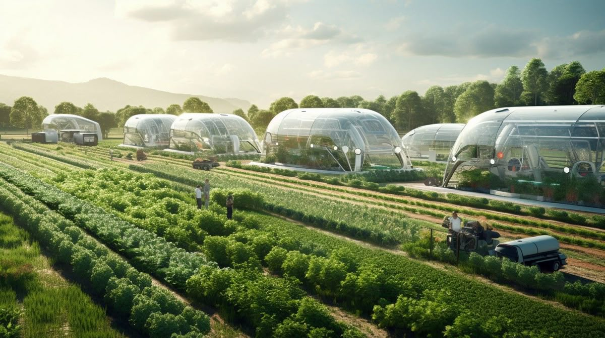
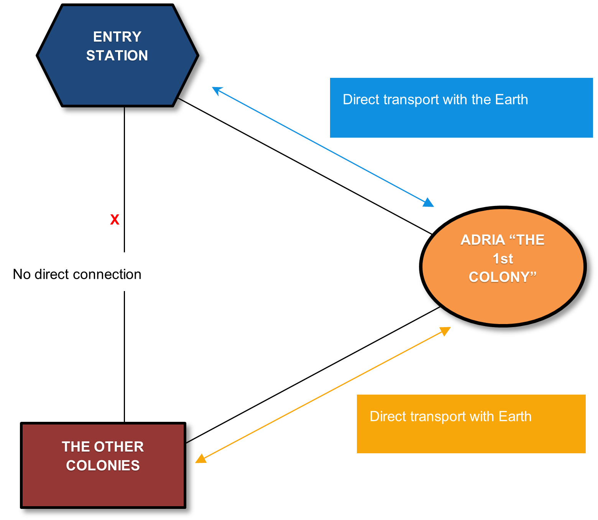

# 2.2. Context - restrictions

Following restrictions apply to the project.

## 2.2.1. Earth: current settlements in 2084

### The Entry Station

The Entry Station is the **single point of entry** for all lifeforms seeking residency on Adria, the first colony on Earth since the Global Disaster. There is a crew manning the station around the clock, but otherwise it is largely populated by "passer-by"s.  Quarantine procedure will require people to stay for a short period of time, both traveling on and off-planet. This means you'll get a **short engagement** from many users, but never for more than a couple of weeks. The **range of people reached** with any type of advertising is **highest** here. 

### Adria: the First colony
Adria, the First colony is where the magic’s at. This **fully-operational colony** is a small indicator of what life will be again on Earth.   Complete with extensive medical facilities, schools for the youngest, lush greenhouses, robuust research lab and extensive R&R amenities, this is the heart of Earth. There is **need for expansion and diversification**. The colony is looking for new souls and ideas to shape the Adria’s identity. 

 

### The Other colonies
Where Adria is fully operational, other colonies around the world are built to obtain the same objective. For now, those places are under construction.  
People stay there for extended periods, lacking all the comfort from Adria, only the basic needs provide, sometimes for months. **Work is the main focus** of the populace, with medium breaks for much needed R&R (Rest & Relaxation), after **travelling by the Earth Voyager** to the Adria Colony.

 

### Travel restrictions
Travel is only possible in the directions of the diagramme between the current settlements.  

### Other restrictions
Do not find yourself constrained by current technological limitations and assume the tech can handle it.  
If you can think of it, it's possible with **the exception of time travel, inter-dimensional travel and zombies** - we are not yet in the year 3000. 

## 2.2.2. Conventions and terminology
You may assume the following about current Adria’s life.

### AdriaOS - One OS to rule them all
Do not concern yourself over compatibility between devices. There is one OS to rule them all,
AdriaOS, which supports all resolutions for Adria’s approved devices. The hardware across
these devices is consistent.

### Adria's devices
All people (on Earth, on Mars, on the space station) have **an implanted chip** that is used for
identification and monitoring (vital signs, localization, …).

Upon arrival all Adrians are given **a device which can project an interactive interface of any size on any surface** (or even lacking surface). They can also act as **a trigger to activate nearby sensors** to interact with the environment. It comes in the shape of a wristband, with the
projection unit on top.

### AdrianID
Every Adrian has an ID integrated into their chip and connected wristband. The individual's
identity is validated upon arrival and encoded into the chip. As a result of this, **all applications in the Adrian environment are required to use AdrianID for authentication**. Registration or Login
forms are forbidden by Adrian law!

### AdriaCoin or the ADCO
All currency on Adria is handled via the blockchain-based AdriaCoin (ADCO). For calculations
you can use the conversion of 1 ADCO = 1 EURO in 2025.